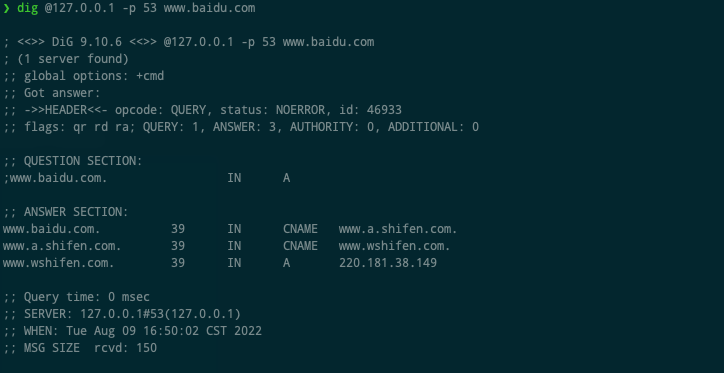
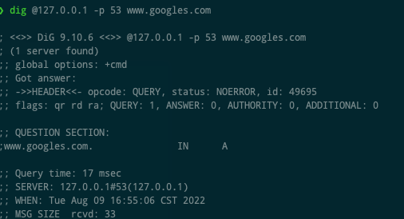

# zzdns

## 简介

一款本地DNS服务器, 接收本地客户端的DNS请求, 同时发送到多个上游服务器, 只要其中一个服务器返回了结果, 立马将结果返回到客户端。
如果该次请求是A记录查询, 那么此次返回的DNS报文的TTL会被设置为10, 该域名会加入到后台线程, 重新请求所有配置好的上游DNS服务器(超时时间(2s)内拿到尽可能多的结果), 
解析所有的报文, 只保留TCP连接最快的IP, 然后缓存报文。

- 支持上游服务器协议: UDP/TCP.

```
{
    "upstreams": [
        {
            "host": "https://dns.alidns.com/dns-query"
        },
        {
            "host": "1.1.1.1"
        },
    ]
}
```

- 支持域名预加载, 提前缓存可能访问的域名。


## 效果
- 有缓存的情况下, 本地客户端请求该服务器, 基本不到1ms.



- 无缓存的情况下, 请求时间是根据最快的上游服务器的时间。




## 使用说明

### 使用docker

  - docker run方式: `docker run -it -e RUST_LOG=info -p 9053:53/udp classmatelin/zzdns`
  - docker-compose: 见[lazy-docker](https://github.com/ClassmateLin/lazy-docker/blob/main/docker-compose.dns.yml)


### 使用二进制包

- [下载对应平台的二进制包](https://github.com/ClassmateLin/zzdns/releases), 使用命令`RUST_LOG=info ./zzdns`执行。

- config/config.json是配置文件。

- config/domain.txt是需要预先缓存的域名列表。
